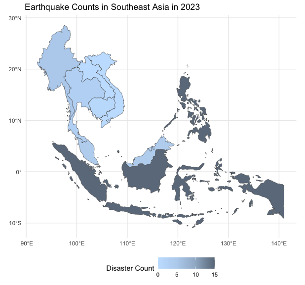
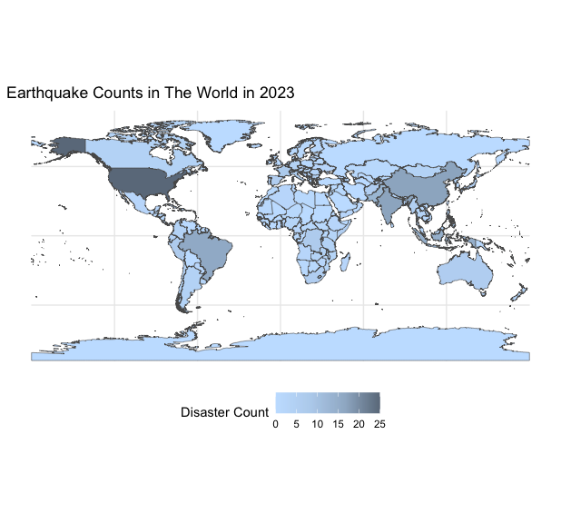
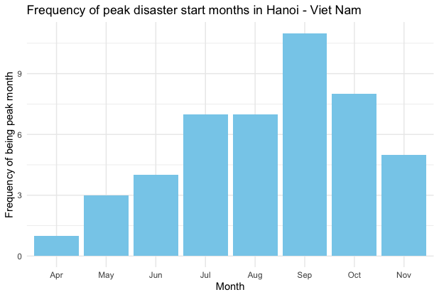
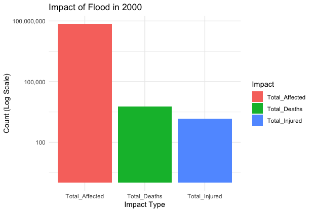

# disasteRs 


disasteRs is an R package designed to help users explore patterns and trends of natural disasters around the world. Whether you're a researcher, a student, or simply curious about global disaster trends, this package provides an intuitive way to visualize and analyze natural disasters' frequency, timing, and impact.  

## Features  

Currently, the package includes three main functions:  

1. **`plot_disaster_map_world()`** and **`plot_disaster_map_sea()`**
   - **Purpose**: Displays the frequency of natural disasters on a world map.  
   - **Output**: A choropleth map where darker regions represent areas with higher frequencies of disasters.  
   - **Use case**: Quickly identify which regions are most prone to natural disasters.  

2. **`disaster_month()`**  
   - **Purpose**: Summarizes and visualizes the month(s) with the most frequent disaster occurrences within a specified time frame for a certain region in a country.  
   - **Output**: A bar graph and a summary showing the number of disasters starting each month.  
   - **Use case**: Analyze seasonal trends in disaster occurrences in a certain region.  

3. **`analyze_disasters()`**  
   - **Purpose**: Summarizes and visualizes the human impacts (e.g., total deaths, affected, injured) of a certain disaster type for a given year.  
   - **Output**: A bar graph or a table (or both) breaking down the magnitude of different disaster impacts.  
   - **Use case**: Assess the human cost of certain disasters in a certain year.  

## Installation  

To install **disasteRs**, use the following commands in R:  

```R  
# Install development version from GitHub  
devtools::install_github("MiaTran1112/disasteRs")  
```  

## Usage  

Here’s an example workflow using **disasteRs**:  

```R
# Load the package  
library(disasteRs)
```
Users can visualize the distribution and frequency of different types of natural disasters over the whole world and South East Asia in a certain year:

```R
# Visualize the the distribution and frequency of earthquakes over the world and South East Asia in 2023
plot_disaster_map_world(disaster_type = "Earthquake", year = 2023)
plot_disaster_map_sea(disaster_type = "Earthquake", year = 2023)
```


Users can also analyze the month(s) with the most frequent peak disaster starts over a span of multiple years in a country location and visualize the frequency of peak months with function **`disaster_month()`**. This function allows users to download their own dataset from **[EM-DAT website](https://www.emdat.be/)** for more flexibility.

```R
#Analyze the peak disaster starts month in Hanoi, Vietnam with a personalized dataset download from EMDAT website
disaster_month(data = disaster_data, location = Hanoi, country = Vietnam)
```
Result:

```R
In the last 24 years, the month most frequently having the largest number of disaster starts in Hanoi is: Sep with a count of 11 times.
```


Lastly, users can summarize and visualize the impacts (e.g., total deaths, affected, injured) of a specific disaster type for a given year. The user can choose to return either the summary, the plot, or both.

```R
# Analyze flood impacts in 2000 with both summary and visualization plots  
analyze_disasters(disaster_type = "Flood", year = 2000, output = "both")  
```
Result:
```R
$Summary
# A tibble: 1 × 3
  Total_Deaths Total_Injured Total_Affected
         <dbl>         <dbl>          <dbl>
1         5966          1504       73900331

$Plot
```


## Data Requirements  

The package utilizes disaster data from the **[EM-DAT database](https://www.emdat.be/)**. Users can access the site to:  
- Adjust the dataset to specific regions or timeframes.  
- Download custom datasets to use with the package functions.  

For the **`plot_disaster_map()`**, **`plot_disaster_map()`**, and **`analyze_disaster()`** functions, we include a built-in dataset to provide immediate functionality without requiring additional downloads. At the same time, for the **`disaster_month()`** function, we allow users to download their own datasets from EMDAT website for more personalized preferences and flexibility.

Required columns in the dataset for **`disaster_month()`**:  
- **Location** (e.g., region name)
- **Country** (e.g., country name that a certain region locates in)
- **Start Year** (e.g., disaster start year)  
- **Start Month** (e.g., disaster start month)

Required variables for  **`plot_disaster_map()`** and **`plot_disaster_map()`**:
- **disaster_type** (e.g., Drought, Flood, Earthquake)  
- **year** (e.g., disaster start year)

Required variables for **`analyze_disaster()`**:
- **disaster_type** (e.g., Drought, Flood, Earthquake)  
- **year** (e.g., disaster start year)
- **output** (e.g., both, summary, plot)

## Contributions  

We welcome contributions! If you have suggestions for new features or find any bugs, feel free to create an issue or submit a pull request.  

## Authors  

- **[Mia Tran](https://github.com/MiaTran1112)**
- **[Chi Mai](https://github.com/ChiMai24)**
- **[Alua Birgebayeva](https://github.com/alua222)**

## License  

This package is licensed under the MIT License.  